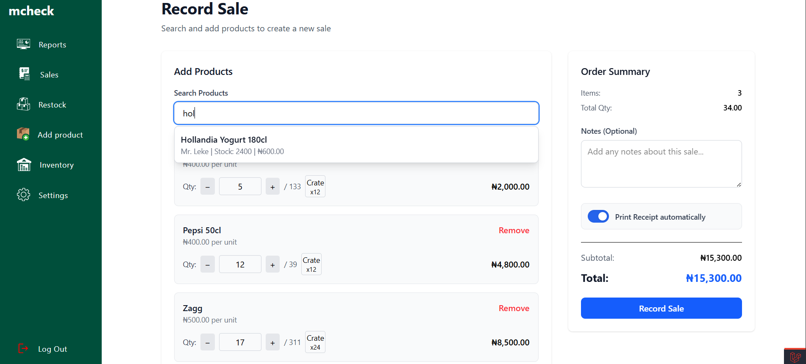
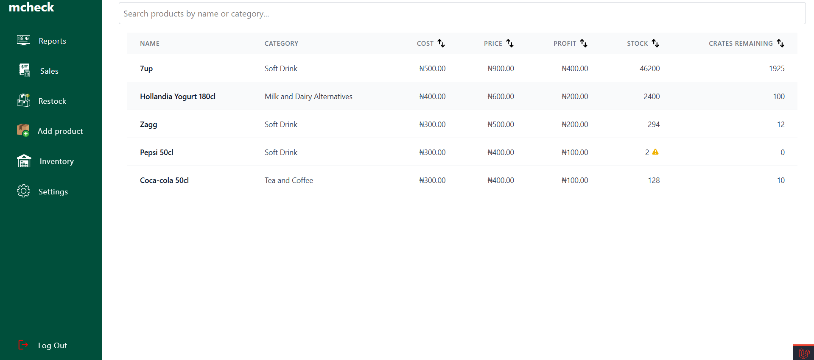
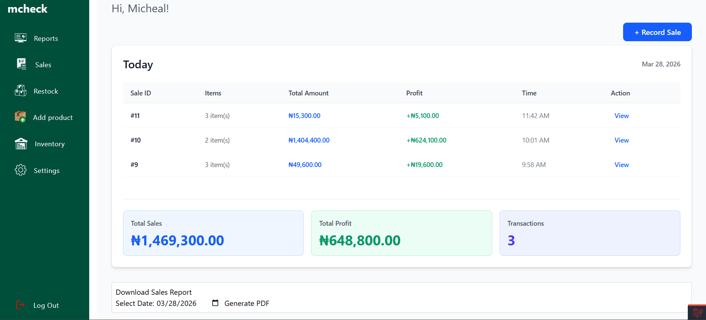
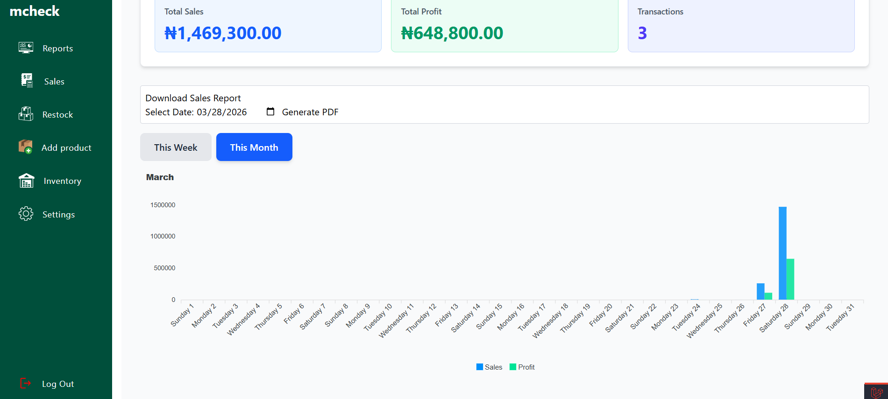
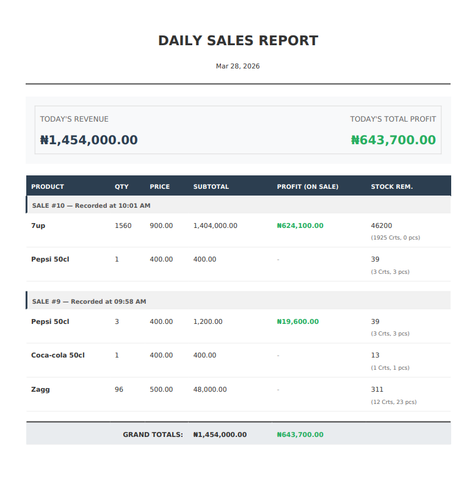
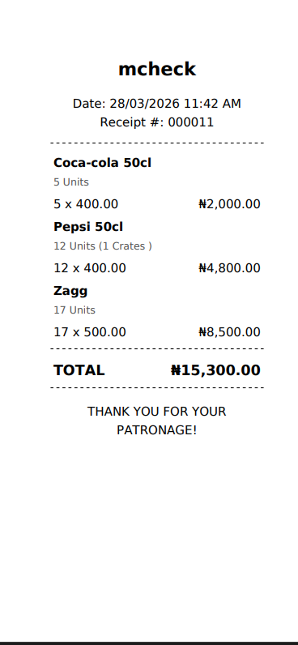

# 🥤 Drinks Inventory Management System

A robust, single-tenant inventory management and Point of Sale (POS) system built specifically for beverage retailers. This project handles the complexity of "Crate vs. Loose Unit" sales, automated thermal receipt generation, and real-time stock monitoring.

## 🚀 Key Features
*   **Smart Sales Terminal:** A high-speed sales interface with real-time product search and automated "Unit to Crate" conversion logic.
*   **Intelligent Stock Management:** Tracks inventory at a granular level. Includes a "Blinking Low-Stock Alert" system based on user-defined thresholds.
*   **On-Demand PDF Reporting:** Generate comprehensive daily sales reports including revenue, total profit, and remaining stock (displayed in both Units and Crates).
*   **Thermal Receipt Generation:** Instant PDF receipt generation using `barryvdh/laravel-dompdf`, optimized for 80mm thermal printers with full Unicode/Currency symbol support.
*   **Financial Dashboard:** Visual analytics for daily sales, profit margins, and 7-day/monthly trends using interactive charts.
*   **Security & Speed:** Secure password management system utilizing **Laravel Queues** to handle background email tasks, ensuring zero lag during user profile updates.

## 📸 Visual Preview

### 🖥️ Point of Sale & Inventory


| Sales Terminal | Stock Management |
|:---:|:---:|
|  |  |
| *High-speed sales interface with auto-conversion* | *Real-time monitoring with low-stock alerts* |

### 📊 Business Intelligence & Analytics


| Dashboard Metrics | Dashboard Charts |
|:---:|:---:|
|  |  |
| *Real-time sales and profit stat cards* | *7-day and monthly interactive trend charts* |

### 📑 Professional Reports


| Daily Sales PDF | Thermal Receipt |
|:---:|:---:|
|  |  |
| *Detailed daily breakdown for administrative audit* | *80mm optimized receipt for thermal printers* |


## 🛠️ Technical Stack
*   **Framework:** Laravel 12 (Monolith)
*   **Frontend:** Blade Templates, Tailwind CSS
*   **Background Tasks:** Laravel Queues (Database Driver) for asynchronous mail handling.
*   **Interactivity:** Vanilla JavaScript (Product search, Cart logic, Auto-print triggers).
*   **Database:** SQLite (Perfect for local/small business deployment).
*   **Reporting:** DomPDF (Custom-sized retail receipts & Daily Sales summaries).

## 🧠 Notable Implementations
*   **System-Wide Idempotency Protection:** Implemented a UUID-based token system in both the Sales and Product controllers to prevent duplicate entries caused by accidental double-clicks or page refreshes.
*   **Historical Data Integrity:** The system captures `units_per_crate`, `price`, and `cost` at the exact moment of sale on a pivot table. This ensures historical receipts and profit reports remain 100% accurate even if prices change later.
*   **Async Password Management:** The password update system is powered by **Laravel Queues**. By offloading email notifications to a background worker, the interface remains lightning-fast with no "loading hang" while sending mail.
*   **Automated Daily Emails:** Includes a custom Artisan command to bundle today's sales into a PDF and email it to the admin automatically.
*   **Optimized UX:** Leveraged Laravel's Session Flashing and JavaScript to bypass browser pop-up blockers for a seamless "Click-to-Print" receipt experience.

## ⚙️ Installation & Setup

1. **Clone the repository**
   ```bash
   git clone https://github.com/lemansz/drinks-inventory-management-system.git
   cd mcheck

2. Install Dependencies
```bash
composer install 
npm install && npm run build
```

3. **Environmental Setup**
```bash
cp .env.example .env
php artisan key:generate
```
4. **Database Migration**
```bash
php artisan migrate --seed
```

5. **Start the application**
```bash
php artisan serve
```
### In another terminal, start the queue worker for fast password/email handling
```bash
php artisan queue:work 
```
📊 Running Reports
Since this project is designed for local deployment, you can trigger the automated daily email report manually at the end of your shift:
To send today's sales report to your email:
```bash
php artisan app:send-daily-report
```
Note: You can also download any past daily report directly from the Dashboard using the built-in Date Picker.

🔑 Demo Access
Access the dashboard using the following credentials:
* URL: http://127.0.0.1:8000
* Email: test@example.com
* Password: 12345678
